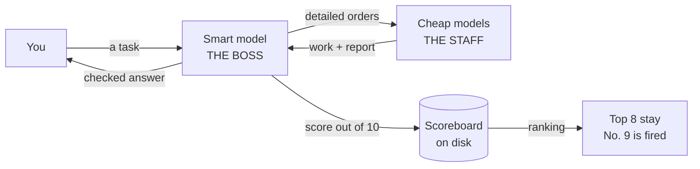
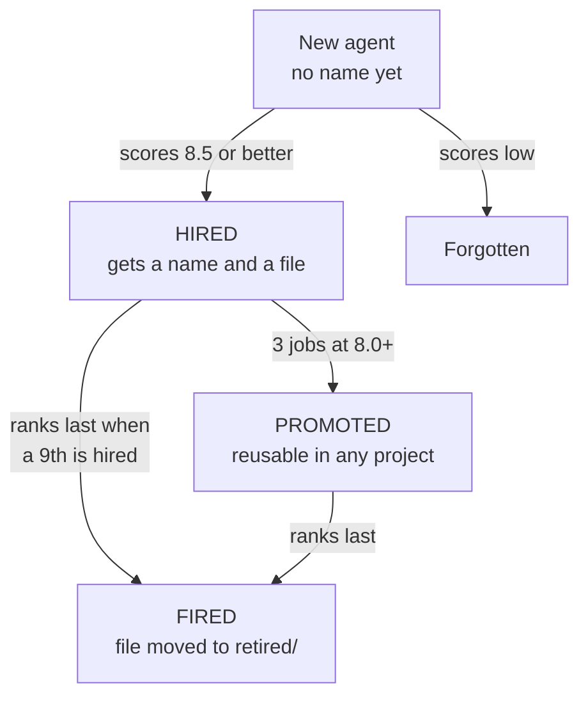

# Rank and Yank

**Your smartest model is expensive. Stop using it to type.**

It becomes the boss. Cheap models do the work. Every job gets a score. The worst worker gets
fired.



---

## The whole idea in 20 seconds

- The smart model **thinks**. It plans, writes orders, and checks the work.
- The smart model **never** greps, types code, or runs tests. That is wasted money.
- Cheap models **do** all of that.
- Every finished job gets **scored out of 10**.
- Workers who score well get **saved and reused**. Workers who score badly get **cut**.
- Each project has room for **8 workers only**.

You pay for one good brain and many cheap hands.

---

## It is natural selection

Your agents are not anonymous. Each one has a name, a job, and a score history on disk.

They compete. Only the best 8 keep their spot.



**How a worker gets hired.** It scores 8.5 or better on a job that will come up again. The boss
writes down what worked and saves it as a reusable worker.

**How a worker gets fired.** The roster is full at 8. Hire a 9th and whoever ranks last is gone.
Even a good worker can be cut for being last in a strong team. New workers get 3 jobs of grace
first, so nobody is cut before they have had a fair chance.

**Every worker sees its own standing.** Its score. Its rank. Who got fired last. It knows the
next job matters.

---

## Workers can talk back

The best thing a worker can do is tell the boss the orders are wrong.

So there is a reward for it.

| What the worker did | Score change |
| :--- | :---: |
| Caught a real mistake that would have caused damage | **+1.0** |
| Found a real improvement | **+0.5** |
| Brought proof, but was wrong anyway | **0** |
| Just guessed. No proof | **-0.5** |
| Said nothing | **0** |

Three rules keep this honest:

1. **Show proof.** Point at a file and line, or real command output. "This might be a problem" is
   a guess, and guessing costs points.
2. **Stay in your lane.** Only complain about your own job. Do not go hunting through the rest of
   the code for something to report.
3. **Being wrong is free.** Bring real proof and still be wrong, you lose nothing. Punishing
   honest mistakes just teaches workers to stay quiet.

When the boss agrees, it fixes the orders and sends them back to **the same worker**, so no work
is thrown away.

---

## Workers can rewrite their own job description

Each worker reads its job file before it starts. If the job file does not fit this task, it says
so, works its own better way, and the boss decides after.

| What the worker proposed | Score change |
| :--- | :---: |
| A real improvement. Boss keeps it | **+0.5** |
| Fair idea, boss says no | **0** |
| Trying to make its own job easier | **-0.5** |

Good changes get written into the file, credited to the worker who spotted them.

---

## Bad orders are the boss's fault, not the worker's

Before writing any score, the boss asks one question:

> Could any good worker have gotten this right from my orders alone?

If no, the worker is **not** punished. The boss writes its own mistake down in a checklist
instead, and reads that checklist before writing the next orders.

This matters. Without it, the scores measure how well the boss writes orders, not how well the
workers work, and the wrong people get fired.

**One exception.** If the worker *spotted* the bad orders instead of tripping over them, it gets
a full score plus the bonus. Tripping is free. Catching is what you are paying for.

---

## Install

Pick either.

**As a plugin:**

```
/plugin marketplace add bazarkua/rank-and-yank
/plugin install rank-and-yank@rank-and-yank
```

**As a plain skill:**

```bash
git clone https://github.com/bazarkua/rank-and-yank ~/.claude/skills/rank-and-yank
```

It turns itself on for real work. You do not need to call it every time.

---

## What shows up on your disk

Nothing is written until you actually give it a task.

```
~/.claude/rank-and-yank/
├── BRIEF-CHECKLIST.md          mistakes the boss keeps making
└── projects/
    └── my-app/
        ├── STANDINGS.md        the ranking
        ├── RUNS.md             every job, every score
        ├── BRIEF-CHECKLIST.md  mistakes specific to this codebase
        └── personas/           your 8 workers
            └── retired/        the ones you fired
```

One job looks like one line:

```
2026-01-04 | sonnet-01-scout | 9.3 | C9 X8 S9 R9 | +1.0 | refactor the loader
             CHALLENGE upheld: my orders pointed at the old copy in legacy/.
             The real callers are in core/. Fixed and resumed.
```

Scores come from four things, each out of 10:

| | |
| :--- | :--- |
| **C** | Is it correct? |
| **X** | Is it all there? |
| **S** | Did it follow orders? |
| **R** | Was the report usable? |

---

## Honest limits

- This is discipline written in words, not code. Nothing forces the boss to keep score. If it
  stops scoring, this is just normal delegating.
- Scores are judgments, not measurements. Four fixed questions and required proof keep them
  steady enough to rank on.
- Reviewing still costs money. The savings come from not doing the typing.
- Not worth it for tiny jobs. Reading one file yourself is cheaper than hiring someone.
- The roster starts empty. Your first few jobs go to nameless workers trying out for a spot.

---

## About the model names

The skill says Opus, Sonnet, and Haiku because that is what Claude Code accepts. Read them as
roles: one expensive brain, a solid worker, and a cheap pair of hands. Swap in your own.

---

MIT licensed. Built by [Adilbek Bazarkulov](https://github.com/bazarkua).
